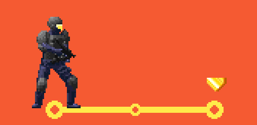

# ZDoom Pathfinding

   

Robust navigation mesh pathfinding for **[ZDoom](https://zdoom.org/index)**.

## Contents

* **[Prerequisites](##Prerequisites)**
* **[PK3 Structure](##PK3-Structure)**
* **[ZNav API](##API)**
  * [ZLevelHandler](###ZLevelHandler)
  * [ZNavHandler](###ZNavHandler)
  * [ZNavNode](###ZNavNode)
  * [ZNavMesh](###ZNavMesh)
  * [ZNavAgent](###ZNavAgent)

## Prerequisites

First, generate nav mesh JSON with **[zdoom-navmesh-generator](https://github.com/disasteroftheuniverse/zdoom-navmesh-generator)**.

An example of basic movement is provided, but you will likely need to tailor your movement code to suit your specific needs. The best way to learn is to see how it all works in the provided [example file](example/example.pk3).

## PK3 Structure

<pre><b>YOUR_GAME_OR_MOD.PK3/</b>
├── <b>MODELS/</b>       
│   └─ <b>NAV/</b>             #place your navigation meshes in here
│       ├─ map01.json
│       └─ e1m1.json
├── <b>ZSCRIPT/</b>
│   ├─ <b>ZNAV/</b>            #<a href="https://github.com/disasteroftheuniverse/zdoom-pathfinding"><b>zdoom-pathfinding</b></a> zscripts here (included)
│   └─ <b>ZJSON/</b>           #<a href="https://github.com/RicardoLuis0/ZJSON"><b>ZJSON</b></a> here (included)
└── MAPINFO.txt         #load event handlers here</pre>

## API

### [ZLevelHandler](dist/ZSCRIPT/ZNAV/ZNavHandler.zs)

A base class for event handlers

### [ZNavHandler](dist/ZSCRIPT/ZNAV/ZNavHandler.zs)

This class runs when a map is loaded, looks for a navigation mesh in the `/MODELS/NAV` directory sharing the same name as the current map

### [ZNavNode](dist/ZSCRIPT/ZNAV/ZNavMesh.zs)

A node is a polygon area defined by a set of vertices, portals and a centroid.

##### Properties

- `groupID` **Int** Index of **ZNavGroup** to which this node belongs
- `Centroid` **vector3** The mean position of all vertices in the node.
- `vertexIDs` **array&lt;Int>** List of indices of vertices used to define the polygon.
- `neighborIDs` **array&lt;Int>** List of indices of **ZNavNodes** sharing edges with this polygon.
- `portals` **array&lt;ZNavPortal>** List of **ZNavPortals**, pairs of vertexIDs which define edges shared by neighboring nodes.

### [ZNavGroup](dist/ZSCRIPT/ZNAV/ZNavMesh.zs)

A group is a collection of interconnected nodes. It is always possible to move between two nodes so long as they are in the same group.

### [ZNavMesh](dist/ZSCRIPT/ZNAV/ZNavMesh.zs)

Class containing navigation mesh data, which includes all nodes and groups.

#### getVertex

##### Parameters

-   `vertexID` **Int** Index of vertex.

Returns **Vector3** Position of Mesh vertex at index.

#### FindPath

##### Parameters

-   `groupID` **Int** Group of nodes to search for paths.
-   `startPos` **Vector3** Start Positions.
-   `endPos` **Vector3** Destination.
-   `route` **ZNavRoute** Reference to instance of ZNavRoute, this countains a list of points which define a path.

Returns **boolean** Whether or not it could find a path to destination.

### [ZNavAgent](dist/ZSCRIPT/ZNAV/ZNavAgent.zs)

Base class for pathfinding actors.

#### A_MoveToEx

Move towards actor goal ( the actor's goal, by default ).

### [ZNavRoute](dist/ZSCRIPT/ZNAV/ZNavPortal.zs)

An object which contains paths composed of points (**Vector3**).

#### get

##### Parameters

-   `index` **Int** Get a vertex from list

Returns **Vector3** Point from a list of points.

#### shift

Returns **Vector3** Returns the first point in the route and removes it from the route.

#### pop

Returns **Vector3** Returns the last point in the route and removes it from the route.

#### push

##### Parameters

-   `point` **Vector3** Adds a point to the route.

#### clear

Remove all points from route

#### Special Thanks 

- [Ricardo Luis](https://github.com/RicardoLuis0)
- [Nash Muhandes](https://github.com/nashmuhandes)

